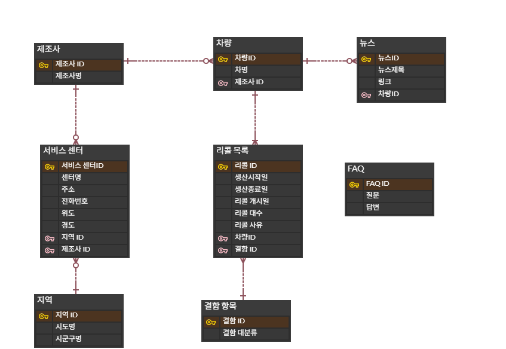
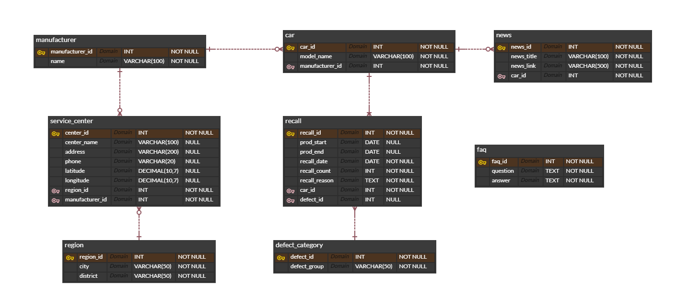

# SKN33-1ST-3TEAM

## 🔎 프로젝트명
### 자동차 리콜 통합 조회 시스템

## 팀 소개
### 팀명: 3조
<table>
<tr>
    <th>김정재</th>
    <th>신진호</th>
    <th>이준희</th>
    <th>유하연</th>
</tr>

<tr>
    <td align="center">
        
    </td>
    <td align="center">
        
    </td>
    <td align="center">
        
    </td>
    <td align="center">
        
    </td>
</tr>

<tr>
    <td align="center">
        <a href="https://github.com/kimjeongjaeae">GitHub</a>
    </td>
    <td align="center">
        <a href="https://github.com/Gitcatho">GitHub</a>
    </td>
    <td align="center">
        <a href="https://github.com/Isnthee">GitHub</a>
    </td>
    <td align="center">
        <a href="https://github.com/lululu9988">GitHub</a>
    </td>
</tr>

</table>

- 김정재: 
- 신진호: 
- 이준희: 
- 유하연: 

### 프로젝트 소개

1. 차량별 리콜 이력 조회
2. 리콜 통계 및 시각화 분석
3. 지역/제조사별 서비스센터 검색
4. 리콜 관련 뉴스 검색
5. 리콜 FAQ 조회

### 💻 기술스택

    
    
    
    
    
    
    
    

### 프로젝트 필요성(배경)

자동차 리콜은 차량 안전과 직결되는 중요한 정보이지만, 
일반 사용자가 자신의 차량에 대한 리콜 여부를 확인하기 위해서는 
여러 사이트를 방문하거나 복잡한 검색 과정을 거쳐야 합니다.

또한 리콜 관련 정보는 제조사, 정부기관, 뉴스 기사 등 
다양한 곳에 분산되어 있어 필요한 정보를 한 번에 
확인하기 어렵다는 문제가 있습니다.

본 프로젝트는 공공데이터와 웹 크롤링 기술을 활용하여 
리콜 정보를 통합 제공하고, 사용자 중심의 조회 기능과 
시각화 서비스를 제공함으로써 자동차 안전 정보의 접근성과 
활용성을 높이고자 기획되었습니다.

### 프로젝트 목표

### 데이터 수집 방법

### DB 설계(논리/물리 ERD)

논리

물리

### 주요기능

1. 메인 대시보드

2. 내 차 리콜 조회

3. 리콜 데이터 분석

4. 가까운 서비스센터 찾기

6. 리콜 뉴스 검색

7. 자동차 리콜 FAQ

### 실행방법

### 수행 화면 캡처

### 회고 